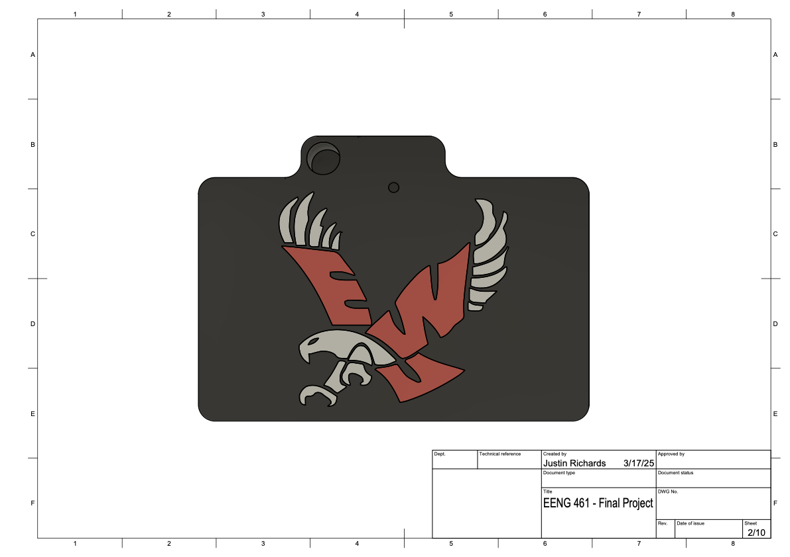
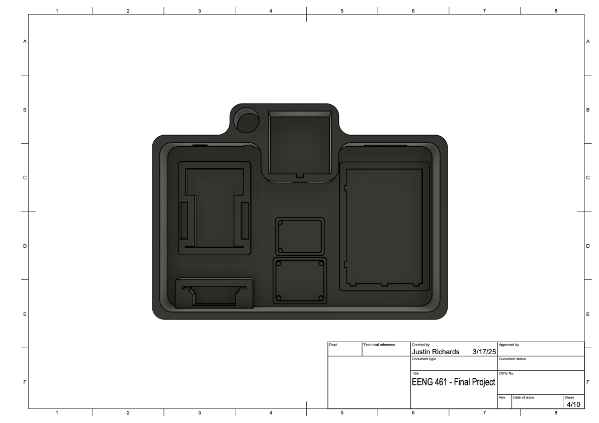

# AquaCore: Automated Hydroponic Control System

**AquaCore** is a self-regulating hydroponics controller designed to monitor and maintain critical growing conditions for plants. Using a TM4C123GXL microcontroller, it integrates sensor data with actuator control to adjust lighting and manage water flow — helping plants thrive with minimal oversight.

Originally developed as a proof of concept, AquaCore demonstrated reliable embedded coordination between sensors, motors, and valves, and later evolved into the more advanced FloraByte platform.

---

## 🔧 About the Project

AquaCore is centered around two primary control loops:

- A **distance sensor** monitors the height between the grow light deck and the plant canopy. Based on this input, a **stepper motor** raises or lowers the lighting system to maintain optimal exposure as the plants grow.

- A **liquid level sensor** monitors the fluid in the reservoir. When the level falls below a threshold, a **solenoid valve** is opened to refill the system. Once it reaches a target level, the valve automatically closes.

An onboard temperature sensor tracks ambient conditions for future expansion. System tasks are synchronized using microcontroller timers and interrupts to ensure responsive and consistent performance.

### Features:
- Light deck automatically tracks plant height  
- Reservoir water level maintained via solenoid valve  
- Real-time feedback from distance, level, and temperature sensors  
- Stepper motor and relay control for actuation  
- Custom 3D-printed housing for sensors and electronics  

---

## 🧩 Schematic & Build Photo

  <!-- Schematic -->
  

    

      
    

    
Wiring schematic showing sensor/actuator pin mapping

  

  <!-- Breadboard -->
  

    
    
Prototype circuit built on breadboard

  

---

## 🖼️ CAD Renderings

  <!-- CAD View 1 -->
  

    
    
Exploded CAD view of enclosure and mechanical system

  

  <!-- CAD View 2 -->
  

    
    
Assembled 3D model of AquaCore enclosure

  

---

## 🧾 Download 3D Model

Want to explore or print the custom 3D enclosure?

👉 [Download AquaCore 3D CAD File (.3mf)](./Base-Lid-Arrow.3mf)

---

## 💻 Code

  <!-- Copy Button -->
  <button onclick="copyCode(this)" style="
    position: absolute;
    top: 8px;
    right: 8px;
    background-color: #3c3c3c;
    color: #fff;
    border: none;
    padding: 4px 8px;
    font-size: 0.75rem;
    border-radius: 4px;
    cursor: pointer;
    z-index: 1;
  ">Copy</button>

  




  

---

## 🛠️ Hardware Used

- TM4C123GXL LaunchPad  
- Optical Distance Sensor (Analog → PB5)  
- Non-contact Liquid Level Sensor (PB0)  
- Temperature Sensor (I2C: PB2/SCL, PB3/SDA)  
- Stepper Motor + Easy Driver (PC4–PC7)  
- Solenoid Valve via Relay (PD2)  
- 3D-printed enclosure (Fusion 360)  

---

## 🧠 Future Ideas

- Add humidity and CO₂ sensing  
- Integrate remote monitoring via Wi-Fi or cloud  
- Solar-powered version with battery backup  
- Upgrade to modular control with machine learning  
