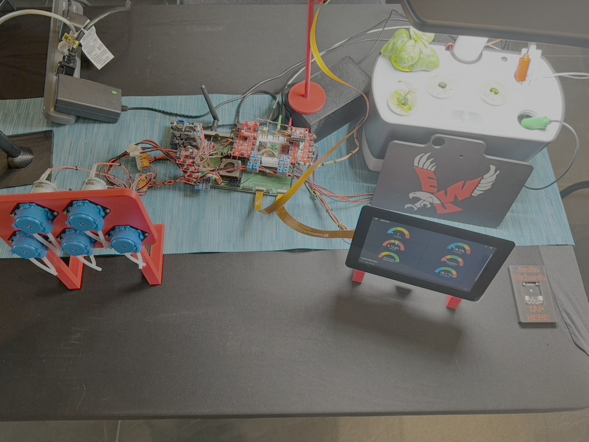
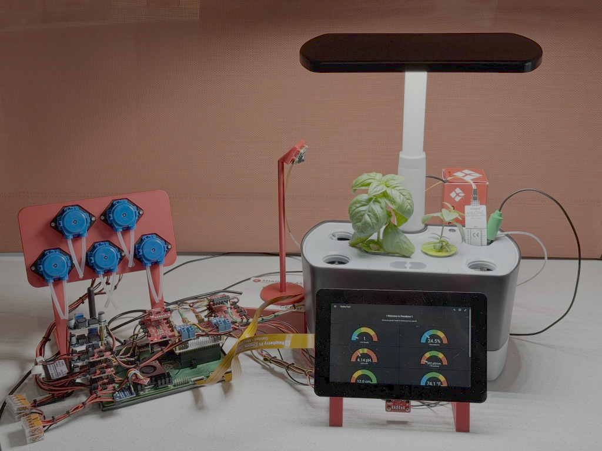

# FloraByte: IoT Hydroponics System for the Smart Countertop

**FloraByte** is a custom-built smart hydroponics solution that transforms any countertop into a fully autonomous growing environment. Built into a repurposed AeroGarden shell and powered by a Raspberry Pi Compute Module 5, this system integrates sensor-driven logic, cloud access, and Home Assistant dashboards to monitor and maintain optimal plant growth conditions with minimal manual intervention.

---

## 🔧 About the Project

This project uses high-precision environmental and water-quality sensors to automate care for plants. With real-time pH, EC, and temperature monitoring from Atlas Scientific sensors, FloraByte intelligently adjusts nutrient levels and pH via micro-dosing peristaltic pumps. A circulation pump ensures even distribution of nutrients through the root zone. The grow light is height-adjustable to optimize photosynthesis, and a smart AI camera enables remote plant health monitoring, including timelapse capture.

All sensor data is logged to Home Assistant and visualized on a custom touchscreen interface. The system supports remote control and is compatible with HomeKit through HomeBridge, making it seamlessly integrated into the smart home ecosystem.

### Features:
- Precision water monitoring: pH, EC, and temperature
- Micro-dosing pumps for nutrients and pH control
- Smart light deck with height control
- Root-zone water circulation
- Home Assistant dashboard with remote access
- AI camera for timelapse and health snapshots

---

## 🖼️ System Photos

  <!-- Image 1 -->
  

    
    
Front view showing plants, light deck, and touchscreen UI

  

  <!-- Image 2 -->
  

    
    
Overhead view showing complete system layout and pumps

  

---

## 🛠️ Core Components

- Raspberry Pi Compute Module 5
- Atlas Scientific pH, EC, and Temp sensors
- Multiple peristaltic pumps for nutrient and pH control
- Circulation water pump
- Adjustable LED grow light deck
- Raspberry Pi-compatible touchscreen
- AI camera with timelapse capture
- Home Assistant dashboard + HomeKit integration

---

## 🔒 Code Availability

Due to the proprietary nature of FloraByte’s control algorithms and system logic, the source code is not publicly available.

---

## 🌱 Future Development

- Add soil sensors to support hybrid soil/hydro systems
- Integrate AI plant health analytics
- Enable cloud-based data logging
- Automate seed germination and lighting cycles
