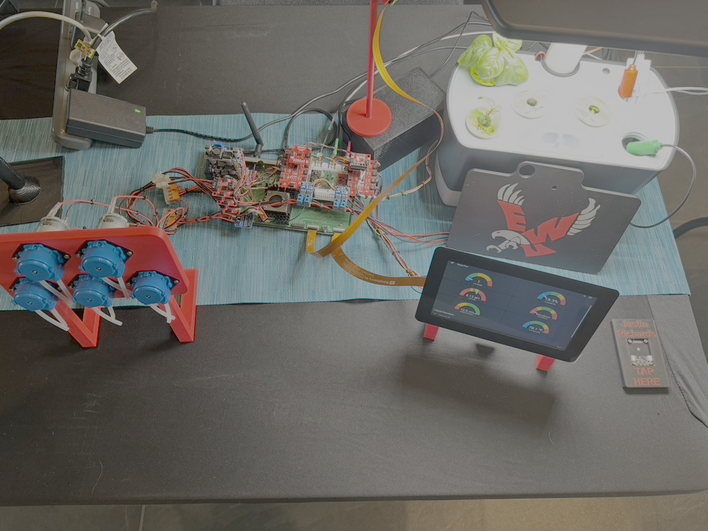
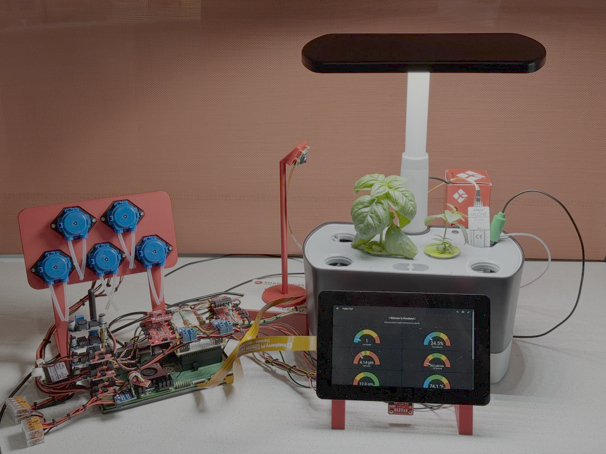



# FloraByte: IoT Hydroponics System for the Smart Countertop

I built FloraByte into an old AeroGarden shell, running on a Raspberry Pi Compute Module 5, to automate pretty much everything about keeping a countertop garden alive.

---

## About the Project

Atlas Scientific sensors handle real-time pH, EC, and temperature monitoring, and peristaltic pumps micro-dose nutrients and pH adjusters based on those readings. A circulation pump keeps nutrients moving through the root zone, the grow light height adjusts on its own as plants grow, and a camera handles remote monitoring and timelapse capture.

Sensor data logs to Home Assistant and shows up on a custom touchscreen interface. It also talks to HomeKit through HomeBridge, so I can check on it the same way I'd check any other smart home device.

### Features:
- Precision water monitoring: pH, EC, and temperature
- Micro-dosing pumps for nutrients and pH control
- Smart light deck with height control
- Root-zone water circulation
- Home Assistant dashboard with remote access
- AI camera for timelapse and health snapshots

---

## System Photos

  <figure>
    
    <figcaption>Overhead view showing complete system layout and pumps</figcaption>
  </figure>
  <figure>
    
    <figcaption>Front view showing plants, light deck, and touchscreen UI</figcaption>
  </figure>

---

## Core Components

- Raspberry Pi Compute Module 5
- Atlas Scientific pH, EC, and Temp sensors
- Multiple peristaltic pumps for nutrient and pH control
- Circulation water pump
- Adjustable LED grow light deck
- Raspberry Pi-compatible touchscreen
- AI camera with timelapse capture
- Home Assistant dashboard + HomeKit integration

---

## Code Availability

I'm keeping FloraByte's control code private for now, so there's no public repo for this one.

---

## If I Came Back to This

FloraByte's the most complete of my projects, so it's the one I'd most likely return to, even though I'm not actively working on it right now. If I did, I'd add soil sensors for a hybrid soil/hydro setup, basic plant-health analytics from the camera feed, and automated seed germination.
